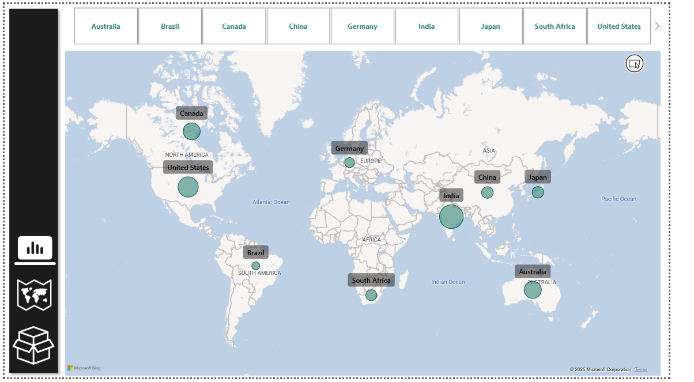

# 📊 XGRIP Power BI Executive Dashboard

---

## 🧩 Objective

Create an interactive, user-friendly dashboard for **XGRIP**, a company specializing in mobile phone accessories.  
The dashboard integrates multi-source data, standardizes currencies, and provides detailed insights into:

- Sales
- Profits
- Product performance
- Returns

🎯 It aims to streamline data analysis and help stakeholders make **informed business decisions**.

---

## 🛠️ Actions Taken

- Integrated multiple data sources (sales, returns, currency rates).
- Cleaned and transformed data using Power Query.
- Developed KPIs and measures with DAX in Power BI.
- Created KPIs for revenue, profit margin, and YoY sales growth(Advanced Dax Calculations).
- Incorporated filters, slicers, and interactive visuals.
- Secured sensitive data based on user roles(Row-Level Security).

---

## 🚀 Execution Steps

1. **Data Preparation**
   - Imported and cleaned data in Power BI using Power Query.
   - Standardized formats and handled missing values.

2. **Dashboard Development**
   - Created visuals: bar charts, maps, cards, pie charts.
   - Added dynamic slicers for regions, categories, and dates.
   - Used DAX to create custom KPIs.

3. **Publishing**
   - Published to Power BI Service for stakeholder access.
   - Enabled scheduled data refresh and access control.

---

## 🌍 Screenshots

### 🌑 Sales Overview Dashboard

### 🗺️ Map View

### 📦 Product Analysis

## 📈 Key Insights

- Identified top-performing regions and product categories.
- Visualized return rates across global markets.
- Enabled stakeholders to explore data with drill-down and filter options.

---

## 🧠 Tools & Tech Used

- **Power BI**
- **Power Query**
- **DAX**
- **Data Modeling**
- **Data Visualization**

---

## ✅ Outcome

✔️ Enhanced visibility into sales and return trends  
✔️ Faster decision-making with real-time insights  
✔️ Streamlined executive reporting for XGRIP

---
